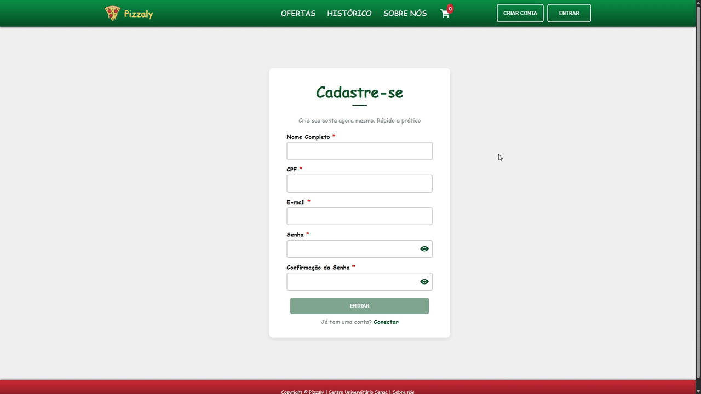
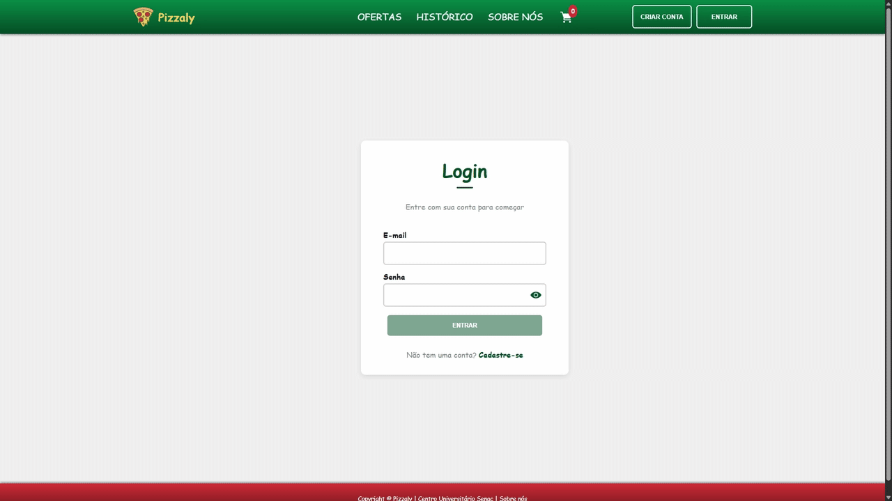
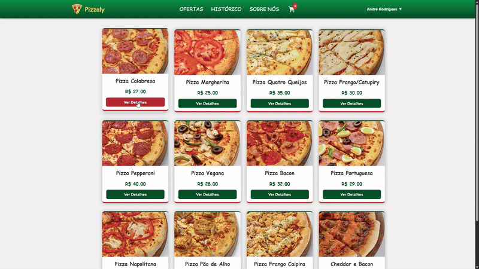
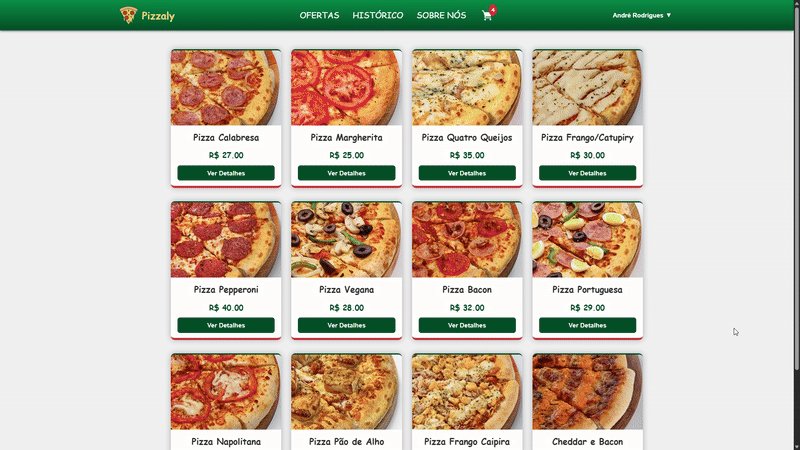
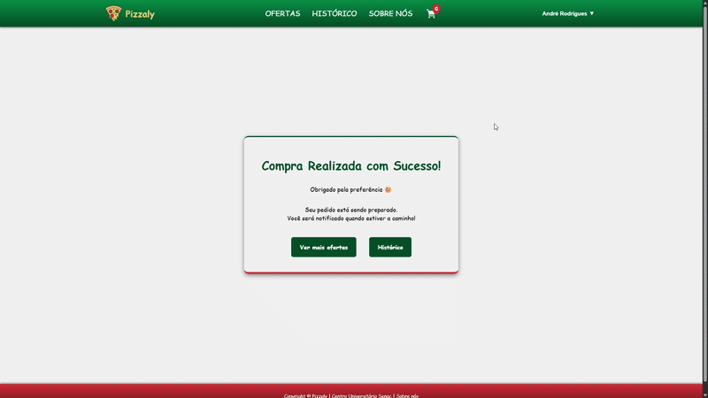

### **Versões utilizadas no Projeto**

- **Node:** v22.18.0
- **NPM:** v11.6.0
- **Angular/CLI:** v20.3.1
- **TSC:** v5.9.2
- **JSON-Server:** v1.0.0-beta.3

---

# **Projeto – Pizzaly** 

Aplicação web desenvolvida em dupla como requisito da disciplina de **Projeto Integrador** do curso de **TADS – Senac**.

## **Integrantes**

- André Rodrigues
- Fernanda Souza

---

## **Visão Geral**

A **Pizzaly** é uma aplicação web com temática italiana que simula o sistema completo de uma pizzaria — catálogo, customização, pedidos e mais.

Todo o frontend foi desenvolvido em **Angular**, enquanto o backend é simulado usando **JSON-Server** para fornecer uma API REST local.

---

## **Objetivo**

Construir uma aplicação funcional integrando **Angular** + **JSON-Server**, entregando:

- Fluxo completo de compra
- Visualização e customização de pizzas
- Carrinho
- Finalização de pedido
- Roteamento dinâmico
- CRUD completo via API fake

---

# **Funcionalidades**

## 🍕 **Catálogo de Pizzas**

- Listagem geral
- Detalhes da pizza
- Exibição de preços, tamanhos e categorias

---

## 🧀 **Montagem Personalizada**

- Seleção de massa, borda e adicionais
- Adição/remoção de customizações
- Atualização dinâmica do preço
- Consumo dos dados via JSON-Server

---

## 🛒 **Carrinho & Pedido**

- Salvamento automático
- Cálculo de subtotal e total
- Finalização completa do pedido
- Diferentes métodos de pagamento com redirecionamento dinâmico

---

## ✔️ **Validações**

Todos os campos que dependem de entrada do usuário contam com validações reais, incluindo cálculo de CPF válido.

Campos validados:

- Nome
- Email
- CPF
- Senha
- Customizações mínimas das pizzas
- Endereço e método de pagamento no checkout

---

## 💾 **Persistência**

Toda a aplicação utiliza um único arquivo `data.json`, contendo:

- Usuários cadastrados
- Pizzas, ingredientes e customizações
- Ofertas
- Carrinho
- Histórico completo de compras

Essa abordagem torna os testes simples e práticos: **um único servidor, um único arquivo, todos os endpoints**.

---

# **Resumo**

O projeto oferece uma experiência completa que simula um sistema real de pizzaria.  
Demonstra domínio de:

- CRUD com Angular
- Integração com JSON-Server
- Validações avançadas
- Persistência local
- Organização modular e boas práticas

---

## 📸 **Exemplos Visuais**

### 🧑‍🍳 Tela de Cadastro

### 🧑‍🍳 Tela de Login

### 🍕 Catálogo de Pizzas

### 🧀 Detalhes / Montagem da Pizza

### 💳 Pagamento / Finalização

### 🧾 Histórico de Pedidos

